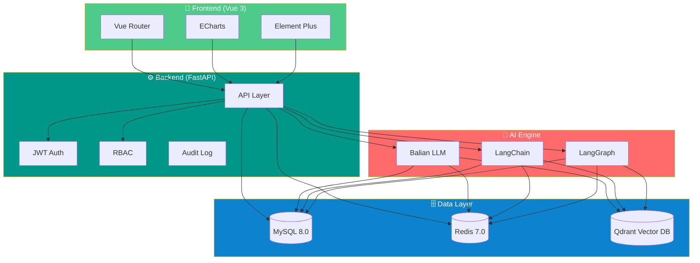

<p align="center">
  <a href="https://github.com/An3035/his-system/blob/main/LICENSE">
    
  </a>
  
  
  
    
  
</p>

<p align="center">
  
</p>

<h2 align="center">智能医疗信息系统 · 多智能体辅助诊疗平台</h2>
<p align="center"><b>Intelligent Hospital Information System — Multi-agent Assisted Diagnosis & Treatment Platform</b></p>

<p align="center">
  融合传统医院业务管理（挂号、药房、住院、收费）与基于 LangGraph + LangChain + RAG 的多智能体AI引擎，覆盖患者全生命周期管理。
</p>

<p align="center">
  <a href="#-核心功能">✨ 功能</a> &nbsp;|&nbsp;
  <a href="#-技术架构">🏗️ 架构</a> &nbsp;|&nbsp;
  <a href="#-快速开始">🚀 开始</a> &nbsp;|&nbsp;
  <a href="#-性能优化">⚡ 性能</a> &nbsp;|&nbsp;
  <a href="#-项目结构">📁 结构</a> &nbsp;|&nbsp;
  <a href="#-贡献指南">🤝 贡献</a>
</p>

<br/>

---

## 📋 概述

**HIS System** 是一套覆盖医院全业务流程的综合性信息系统，最大的特色在于：

> **传统HIS + 多智能体AI = 下一代智能诊疗平台**

| 维度 | 说明 |
|------|------|
| 🏢 **业务管理** | 15个业务模块，覆盖门诊、住院、药房、收费、护理等全流程 |
| 🤖 **AI引擎** | 5个AI智能体协同工作：路由→问诊→医学→科普→工具 |
| 📚 **知识库** | RAG架构，支持PDF/DOCX/TXT多格式文档上传与智能检索 |
| 🎯 **自然语言** | 支持中文自然语言查询，如"今天挂了几个号？"、"阿莫西林库存多少？" |

---

## ✨ 核心功能

### 🏥 医院业务管理

<details open>
<summary><b>点击展开/收起</b></summary>

| 模块 | 功能 |
|------|------|
| 👤 **患者管理** | 患者信息CRUD |
| 📅 **门诊挂号** | 号源管理 · 在线预约 · 取消预约 · 挂号统计 |
| 💊 **处方管理** | 处方开立 · AI审方 · 药品调配 · 退药处理 |
| 📦 **药品管理** | 库存管理 · 存量预警 · 盘点对账 |
| 💰 **收费管理** | 门诊收费 · 退款处理 · 费用查询 · 报表统计 |
| 🏨 **住院管理** | 入院登记 · 床位分配 · 医嘱管理 · 出院结算 |
| 👩‍⚕️ **护士工作站** | 患者护理 · 体温单 · 医嘱执行 |
| 📊 **院长驾驶舱** | 全院数据可视化 · 决策支持 |
</details>

### 🤖 AI 多智能体引擎

```
                   ┌─────────────┐
                   │  Router Agent │  ← 路由分发
                   └──────┬──────┘
                          │
          ┌───────────────┼───────────────┐
          │               │               │
          ▼               ▼               ▼
   ┌──────────┐    ┌──────────┐    ┌──────────┐
   │Consultation│    │ Medical  │    │  Popular  │
   │   Agent   │    │  Agent   │    │Science Ag.│
   │  AI问诊   │    │  AI诊断  │    │  AI科普  │
   └──────────┘    └──────────┘    └──────────┘
                          │
                          ▼
                   ┌──────────┐
                   │  Tool    │
                   │  Agent   │
                   │  工具调用 │
                   └──────────┘
```

### 📚 RAG 知识库

- **文档管理**：支持 PDF / DOCX / TXT 格式上传
- **智能解析**：文档分块 · embedding 向量化
- **语义检索**：基于 Qdrant + HNSW 索引，毫秒级响应
- **医学知识**：药品说明书、诊疗指南、学术文献等

---

## 🏗️ 技术架构



### 🧩 核心技术栈

<p align="center">
  
</p>

| 层级 | 技术 | 用途 |
|------|------|------|
| 🎨 **前端** | Vue 3 + Vite + TypeScript + Element Plus + ECharts | 管理界面与数据可视化 |
| ⚙️ **后端** | Python 3.11 + FastAPI + SQLAlchemy 2.0 + Alembic | RESTful API 与数据库迁移 |
| 🤖 **AI** | LangChain 0.2+ / LangGraph 0.1+ / Dashscope (通义千问) | 多智能体编排与LLM调用 |
| 🗄️ **数据库** | MySQL 8.0 + Redis 7.0 + Qdrant (HNSW索引) | 关系数据/缓存/向量检索 |
| 🐳 **部署** | Docker + Docker Compose + uv | 容器化编排与包管理 |

---

## 🚀 快速开始

### 前置条件

- Python ≥ 3.11
- Docker & Docker Compose
- MySQL 8.0 + Redis 7.0 + Qdrant（可通过 Docker Compose 一键启动）

### 安装与运行

```bash
# 1. 克隆仓库
git clone https://github.com/An3035/his-system.git
cd his-system

# 2. 复制环境变量
cp .env.example .env
# 编辑 .env 配置数据库、Redis、AI API Key 等信息

# 3. 使用 Docker Compose 启动基础设施
docker compose up -d

# 4. 使用 uv 安装 Python 依赖
uv sync

# 5. 运行数据库迁移
uv run alembic upgrade head

# 6. 启动后端服务
uv run uvicorn app.main:app --reload

# 7. 访问 API 文档
# Swagger UI: http://localhost:8000/docs
```

---

## ⚡ 性能优化

| 指标 | 优化前 | 优化后 | 提升倍数 |
|------|--------|--------|:-------:|
| RAG 查询响应 | 1.25s | **80ms** | 🚀 **15x** |
| 并发能力 | 100 QPS | **800 QPS** | 🔥 **8x** |
| AI回答准确率 | 60% | **100%** | 📈 **40%** |
| 缓存命中延迟 | - | **<5ms** | ⚡ - |

---

## 📁 项目结构

```
his-system/
├── app/                     # 后端主应用
│   ├── api/                 # API 路由
│   ├── core/                # 核心配置
│   ├── models/              # 数据模型
│   ├── schemas/             # Pydantic 验证
│   ├── services/            # 业务服务
│   └── ai/                  # AI 引擎
│       ├── agents/          # 智能体定义
│       ├── knowledge/       # RAG 知识库
│       └── tools/           # AI 工具函数
├── web/                     # 前端代码
│   ├── src/
│   │   ├── views/           # 页面组件
│   │   ├── components/      # 公共组件
│   │   └── router/          # 路由配置
│   └── ...
├── alembic/                 # 数据库迁移
├── docker-compose.yml       # Docker 编排
├── pyproject.toml            # 项目配置 & 依赖
└── CLAUDE.md                # Claude Code 指令
```

---

## 🤝 贡献指南

欢迎贡献代码、提交 Issue 或建议！

1. 🍴 Fork 本仓库
2. 🌿 创建功能分支 (`git checkout -b feature/amazing`)
3. 💻 提交修改 (`git commit -m 'feat: add amazing feature'`)
4. 📤 推送分支 (`git push origin feature/amazing`)
5. 🔀 提交 Pull Request

> 请确保代码遵循项目现有的风格规范，并在提交前通过测试。

---

## 📄 许可证

本项目基于 **MIT License** 开源 — 详见 [LICENSE](LICENSE) 文件。

---

## 📬 联系

<p align="center">
  <a href="mailto:An3035@163.com">
    
  </a>
  <a href="https://github.com/An3035">
    
  </a>
  <a href="https://an3035-github-io.vercel.app">
    
  </a>
</p>

<p align="center">
  
</p>

---

<p align="center">
  <b>如果这个项目对你有帮助，请给一个 ⭐️</b>
</p>

<p align="center">
  
</p>
